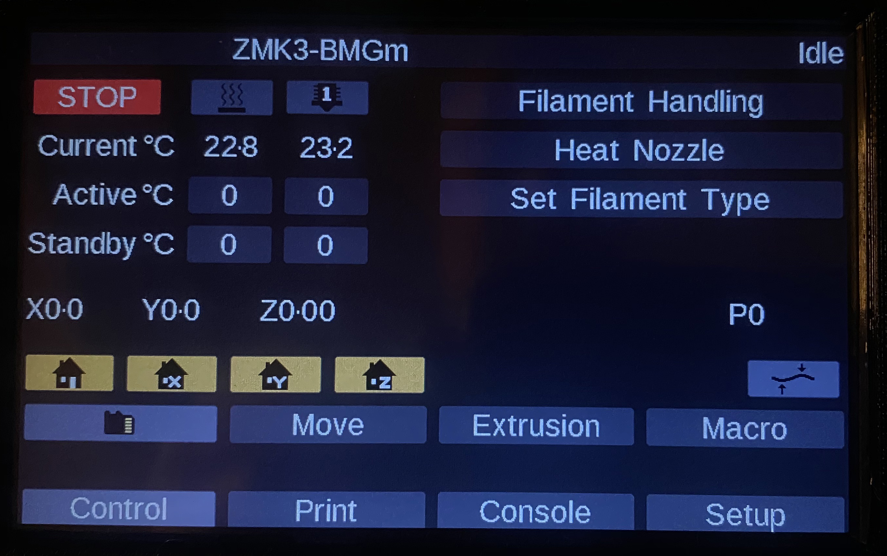

# Prusa MK3s - Duet 2 WiFi - RRF 3.11

## Prusa MK3s - Duet 2 WiFi wiring guide [PDF](Duet-MK3s.pdf)    

<br>

## **Hardware changes from stock Prusa MK3s:**

- Bondtech Mosquito Extruder  

- 0.9 steppers for X and Y axis (17HM15-0904S @ omc-stepperonline.com) 	

- Duet WiFi  
  
- PanelDue 5i  
  
  <br><br>

## **:interrobang:What do those hardware changes mean for your config?**  
1) **:wrench:Motors, microstepping resolution, and steps/mm.**  
Unless you have the same setup as referenced above, you may have to change the microstepping resolution and the steps per millimeter located in the 'config.g' file. To retrieve your current machine's configuration, issue a M503 command in the terminal connected to the running printer. Pay attention to the microstepping assigned to the axis as that can change your steps per millimeter. Read through the /sys/config.g file comments and make the applicable changes as needed.  *More about this can be read here: https://duet3d.dozuki.com/Wiki/Choosing_and_connecting_stepper_motors, here: https://www.linearmotiontips.com/microstepping-basics/, and here: https://blog.prusaprinters.org/calculator3416/.*  
:warning:Once you have changed/verified the motor settings, review the networking top portion of the file. When completed, copy all the files located in the 'sys' directory over to your sd-card's 'sys' folder. Additionally, copy the files located in the 'macros' folder over to your sd-card's 'macros' folder. *More can be read about sd-card here: https://duet3d.dozuki.com/Wiki/SDCard, more can be read about macros here: https://duet3d.dozuki.com/Wiki/Macros.*  

2) **:wrench:Sensorless Homing / Stallguard sensitivity.**  
The TMC2660 drivers used on the Duet WiFi, Duet Ethernet and the TMC5160 drivers used on the Duet 3 support the stallGuardTM feature. This feature allows the driver to detect motor stalls under some circumstances. Stall detection may be useful for detecting when a motor has skipped steps due to the nozzle hitting an obstruction, and for homing the printer without using endstop switches.  
As the given configuration files were authored while using 0.9 degree stepper motors on the X and Y axis, you may need to adjust your stallguard sensitivity and sensorless homing. For stallguard sensitivity, look for the "M915" in the config.g file. *Read the full documentation here: https://duet3d.dozuki.com/Wiki/Stall_detection_and_sensorless_homing.*

 3) **:bulb:Use the included Macros for filament handling.**  
To make filament loading, unloading, and changing the most straightforward and simplistic possible evolution, I have made a set of macro that are readily accessible from the PanelDue.  
**"Set Filament Type"** asks what type filament you are going to use; PLA, PETg, ABS, or PC. Based on the selection, this macro rewrites the "Heat Nozzle" macro to heat the nozzle for the selected filament type.  !Note: This macro only has to be executed once for the given filament type change as it's settings are nonvolatile, regardless of reset or power off.   
**"Filament Handling"** is for any filament unloading, loading, and changing regardless of the printer's state, printing or not. This macro will load, unload, and change filament based on two conditions; whether it detects filament is currently loaded or not, and if a print is in progress or not.  !Note: The logic function in the macro retrieves the current status of the filament sensor to base the perceived desired action to enact. If your printer's filament is currently empty and you intend to load filament, please do not place it into the extruder until requested to do so by the macro. Else the macro will determine that filament is loaded and that you desire to unload filament, instead of load.   
**"Heat Nozzle"** is created by the "Set Filament Type" macro and can be selected to heat the hotend to the set temperature for the last chosen filament type. You do not need to run this to change filament, the "Filament Handling" macro automatically runs this macro to perform the heating of the hotend to carry out the filament handling, whether it be loading, unloading, or changing.



<br><br>

## **Additional notes:**  
**:bulb:Electrically independent Z motors**: On printers, such as MK3, which uses two Z motors to raise/lower the bed or gantry, you can have the firmware probe the bed and adjust the motors individually to eliminate tilt.  The auto calibration uses a least squares algorithm that minimises the sum of the height errors. The deviation before and expected deviation after calibration is reported. Run G32 to initiate the process. *Read the full documentation here: https://duet3d.dozuki.com/Wiki/Bed_levelling_using_multiple_independent_Z_motors.*  

**:bulb:PINDA v2**: Pinda version 2 is upgraded from the previous version in that it now has an integrated thermistor, which this configuration electrically ties to thermistor E1 on the duet.  Pinda temperature compensation has to be mitigated via g-code macro but will be handled via integrated function within the duet firmware shortly.  *Read @Argo's posting in the Duet forums: https://forum.duet3d.com/topic/16972/pinda-2-probe-with-temperature-compensation?_=1593546022132.*    

<br><br>

## **Example start gcode for Prusa Slicer:**  
```g-code
;Start G-Code

G90                                 ; Use absolute positioning
G28                                 ; home
G1 X100 Y100 F3000                  ; place probe about center to stabilized pinda

M140 S[first_layer_bed_temperature] ; set bed temp to first layer temp
M104 S150                           ; set nozzle temp to 150c
M190 S[first_layer_bed_temperature] ; wait for bed temp
M109 S150                           ; wait for extruder temp

G32                                 ; Level R/L Z-axis
G29                                 ; Level Bed

G1 X0 Z0.6 Y-3.0 F3000.0            ; place probe at home position
M104 S[first_layer_temperature]     ; set extruder final temp
M109 S[first_layer_temperature]     ; wait for extruder final temp

G92 E0.0
G1 Z0.2 X200.0 E30.0 F1000.0        ; purge line
G92 E0.0

; pressure advance can be either here or in filament gcode
; M572 D0 S0.11                       ; set pressure advance
```
## **Example end gcode for Prusa Slicer:**  

```g-code
;End G-Code
  
M104 S0                             ; turn off hotend
M140 S0                             ; turn off heatbed
M107                                ; turn off fan

M221 S100                           ; reset extrusuon to 100 percent
G1 F1000.0                          ; set feed rate
G1 E-2                              ; retract
G1 X20 Y200 Z205 F3000              ; home X axis
M84 XYE                             ; unlock motors
```

<br>

<br>

## **Example start gcode for ideaMaker Slicer:**  

```g-code
; ideaMaker Start G-Code

G90                                 ; Absolute Positioning
M83                                 ; extruder relative mode
G28                                 ; home
G1 X100 Y100 F3000                  ; home X axis

M140 S{temperature_heatbed}         ; set bed temp
M104 S150                           ; set extruder temp
M190 S{temperature_heatbed}         ; wait for bed temp

G32                                 ; Level R/L Z-axis
G29                                 ; Level Bed

G1 X0 Z0.6 Y-3.0 F3000.0
M104 S{temperature_extruder1}       ; set extruder
M109 S{temperature_extruder1}       ; wait for extruder temp

G92 E0.0
G1 Z0.2 X100.0 E30.0 F1000.0        ; intro line
G92 E0.0
                                
M572 D0 S0.11                       ; set pressure advance
```

## **Example end gcode for ideaMaker Slicer:**  

```g-code
; ideaMaker End G-Code
  
M104 S0                             ; turn off temperature
M140 S0                             ; turn off heatbed
M107                                ; turn off fan

M221 S100                           ; reset extrusuon to 100 percent
G1 F1000.0                          ; set feed rate
G1 E-2                              ; retract
G1 X20 Y200 Z205 F3000              ; home X axis
M84 XYE                             ; unlock motors
```

<br>

**It is highly recommend to read through the very detailed Duet Wiki pages at https://duet3d.dozuki.com. RepRapFirmware supported G-code reference can be found here https://duet3d.dozuki.com/Wiki/Gcode#main.*

